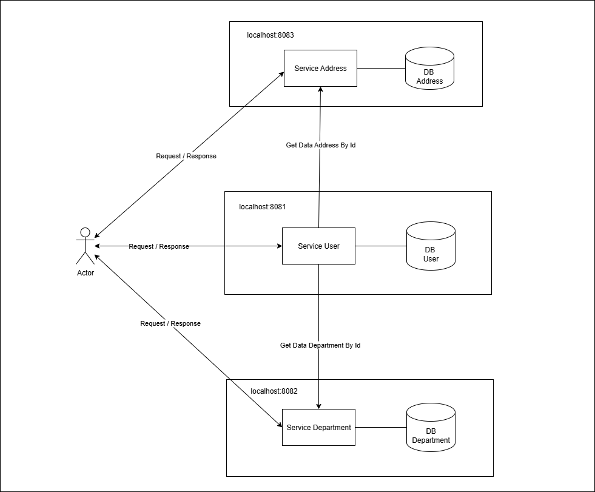

# Simple Microservices – User Management (Spring Boot + WebFlux + PostgreSQL)

This project implements a simple microservices architecture for user management using Spring Boot, WebFlux, and PostgreSQL.

---

## Architecture Overview

This project implements a **Simple Microservices** architecture with **Direct Client-to-Microservice Communication**, featuring an aggregation layer inside the `user-service`.

### How it works:

- Each microservice (`user-service`, `department-service`, `address-service`) runs independently on its own server and port, with its own database.
- Clients (frontend apps, Postman, etc.) can access each service directly via its REST API, without an API Gateway or Backend-for-Frontend (BFF).
- `user-service` uses WebClient (Spring WebFlux) to fetch department and address data from other services, aggregating them before returning to the client.

### Summary of key points:

| Feature                | Description                                            |
|------------------------|--------------------------------------------------------|
| Services               | Independent apps with own DB and ports                |
| Client communication   | Direct REST calls to each service                     |
| Inter-service comm.    | HTTP via WebClient/WebFlux inside `user-service`      |
| Aggregation            | `user-service` aggregates department & address data   |
| API Gateway            | Not used                                               |

---

## Services Overview

- **service-user**: CRUD for user data, uses Spring Boot WebFlux and aggregates department & address info from other services.
- **service-department**: CRUD for department data.
- **service-address**: CRUD for address data.

Each service is self-contained, with its own database and can be developed, deployed, and scaled independently.

---

## Architecture Diagram

<p align="center">
  
</p>

---

## Communication Model

**Direct Client-to-Microservice Communication**

Clients (e.g. frontend apps, Postman) communicate directly with each microservice via REST API endpoints.  
No API Gateway or BFF layer is used in this setup.

### Advantages:
- Simple architecture
- Easy to develop and test services independently
- Clear service boundaries and responsibilities

---

## Dependencies

### Service-Department

- `spring-boot-starter-web`  
- `spring-boot-starter-data-jpa`  
- `postgresql`  
- `lombok`  

### Service-Address

- `spring-boot-starter-web`  
- `spring-boot-starter-data-jpa`  
- `postgresql`  
- `lombok`  

### Service-User

- `spring-boot-starter-web`  
- `spring-boot-starter-webflux`  
- `spring-boot-starter-data-jpa`  
- `postgresql`  
- `lombok`  

---


## configuration

### address-service (application.yml)
```yaml
server:
  port: 8083

spring:
  application:
    name: address-service

  datasource:
    url: jdbc:postgresql://localhost:5432/db_micro_001_address
    username: postgres
    password: root
    driver-class-name: org.postgresql.Driver

  jpa:
    hibernate:
      ddl-auto: update
    show-sql: true
    properties:
      hibernate:
        format_sql: true
        dialect: org.hibernate.dialect.PostgreSQLDialect
```

### department-service (application.yml)
```yaml
server:
  port: 8082

spring:
  application:
    name: department-service

  datasource:
    url: jdbc:postgresql://localhost:5432/db_micro_001_department
    username: postgres
    password: root
    driver-class-name: org.postgresql.Driver

  jpa:
    hibernate:
      ddl-auto: update
    show-sql: true
    properties:
      hibernate:
        format_sql: true
        dialect: org.hibernate.dialect.PostgreSQLDialect
```

### user-service (application.yml)

```yaml
server:
  port: 8081

spring:
  application:
    name: user-service

  datasource:
    url: jdbc:postgresql://localhost:5432/db_micro_001_user
    username: postgres
    password: root
    driver-class-name: org.postgresql.Driver

  jpa:
    hibernate:
      ddl-auto: update
    show-sql: true
    properties:
      hibernate:
        format_sql: true
        dialect: org.hibernate.dialect.PostgreSQLDialect

service:
  department:
    url: http://localhost:8082
  address:
    url: http://localhost:8083

```

## API Endpoints

---

### Service: Address 

Base URL: `http://localhost:8083/api/address`

| Method | Endpoint                 | Description         |
|--------|--------------------------|---------------------|
| GET    | `/getAllAddress`         | Get all addresses   |
| GET    | `/getAddressById/{id}`   | Get address by ID   |
| POST   | `/addAddress`            | Create new address  |
| PUT    | `/updateAddress/{id}`    | Update address      |
| DELETE | `/deleteAddress/{id}`    | Delete address      |

---

### Service: Department 

Base URL: `http://localhost:8082/api/department`

| Method | Endpoint                    | Description          |
|--------|-----------------------------|----------------------|
| GET    | `/getAllDepartment`         | Get all departments  |
| GET    | `/getDepartmentById/{id}`   | Get department by ID |
| POST   | `/addDepartment`            | Create new department|
| PUT    | `/updateDepartment/{id}`    | Update department    |
| DELETE | `/deleteDepartment/{id}`    | Delete department    |

---


### Service: User

Base URL: `http://localhost:8081/api/user`

| Method | Endpoint              | Description      |
|--------|-----------------------|------------------|
| GET    | `/getAllUser`         | Get all users    |
| GET    | `/getUserById/{id}`   | Get user by ID   |
| POST   | `/addUser`            | Create new user  |
| PUT    | `/updateUser/{id}`    | Update user      |
| DELETE | `/deleteUser/{id}`    | Delete user      |

---
